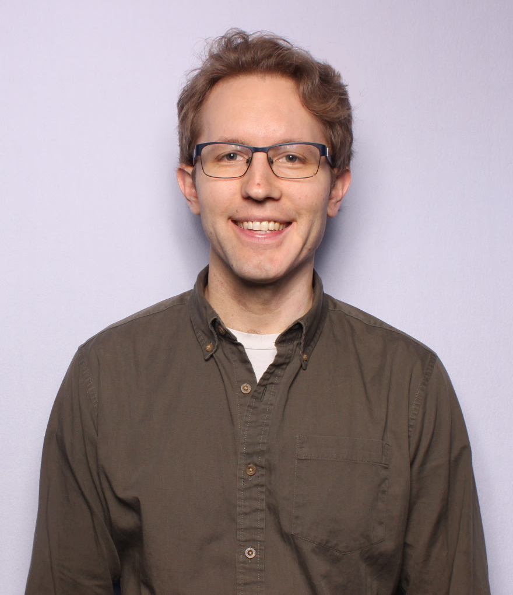

I am a PhD student in computer science at Tufts University, where I am advised
by Dr. Kathleen Fisher. My research interests are in programming languages and formal
verification. My current research involves using interactive theorem proving techniques
to verify PL infrastructure and data-processing tools. 
